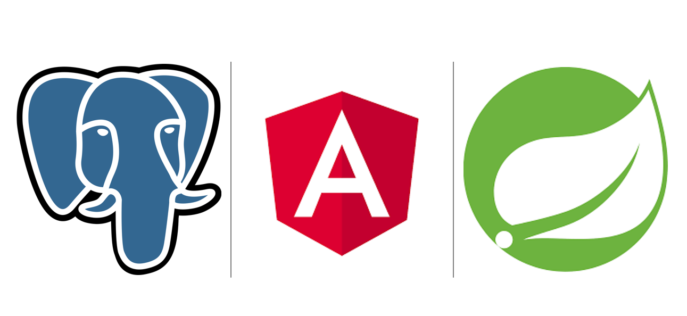
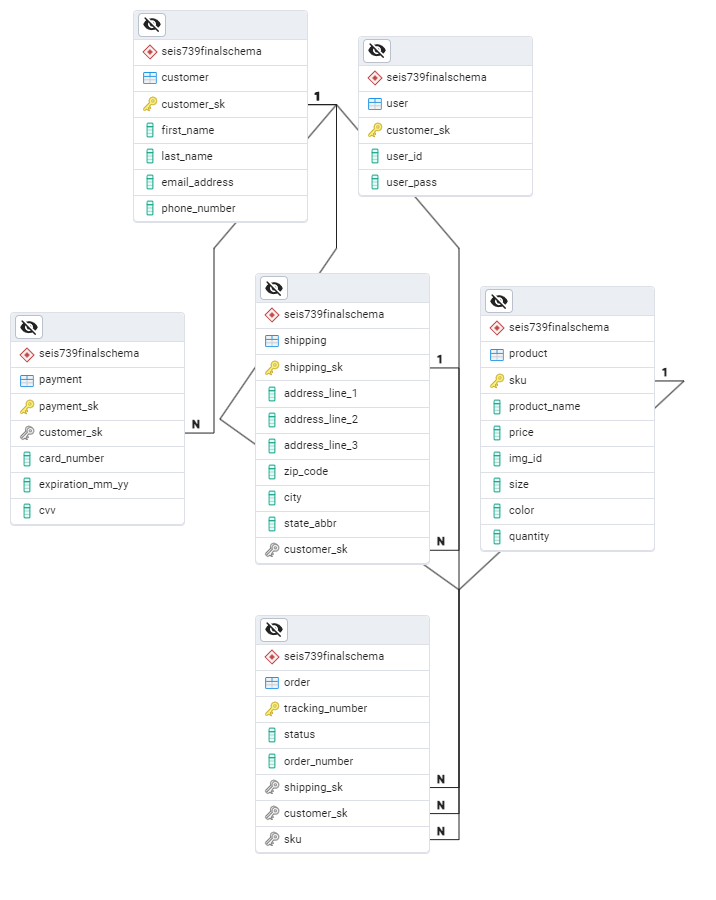
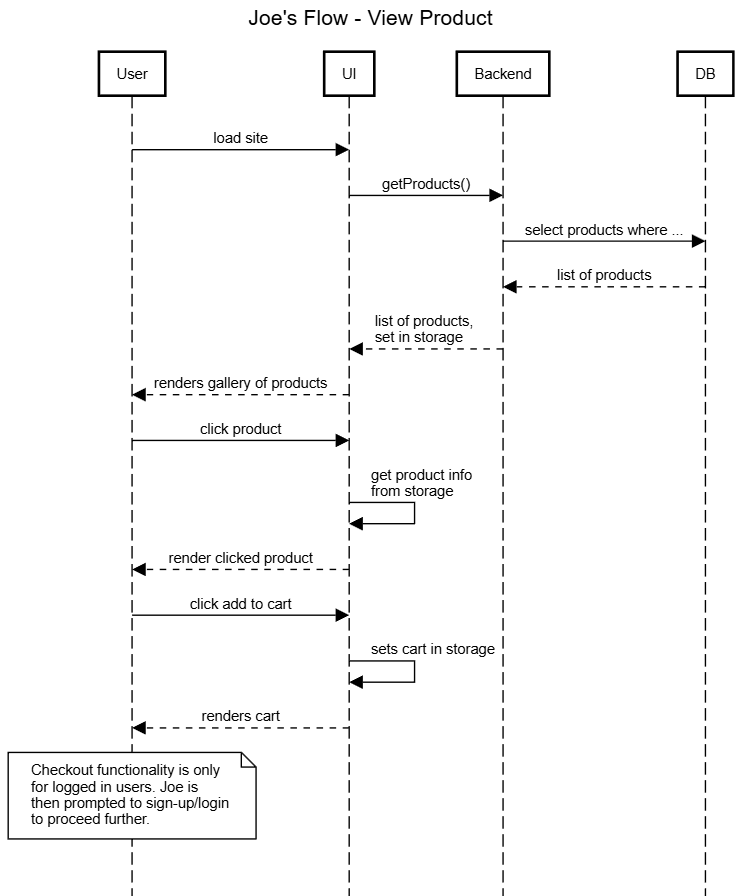
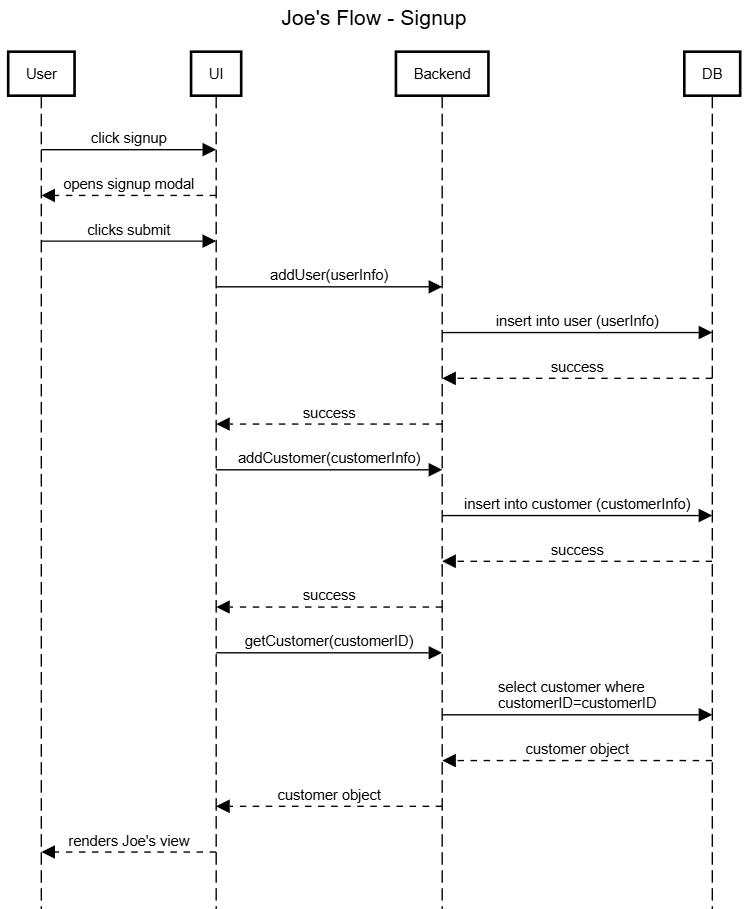
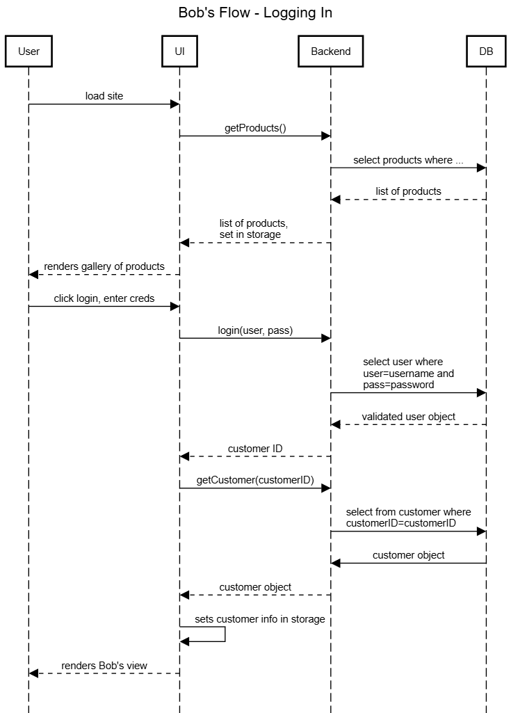
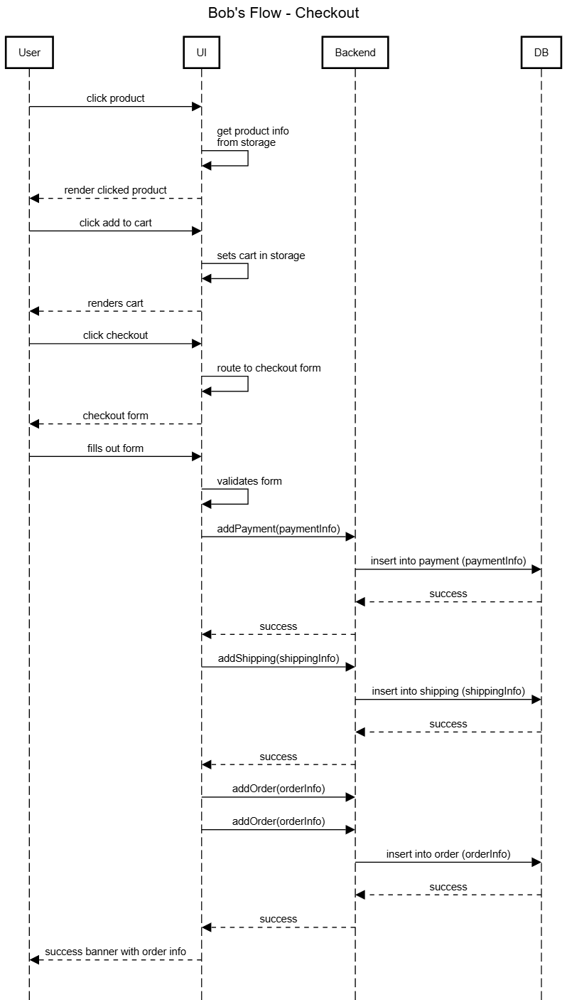
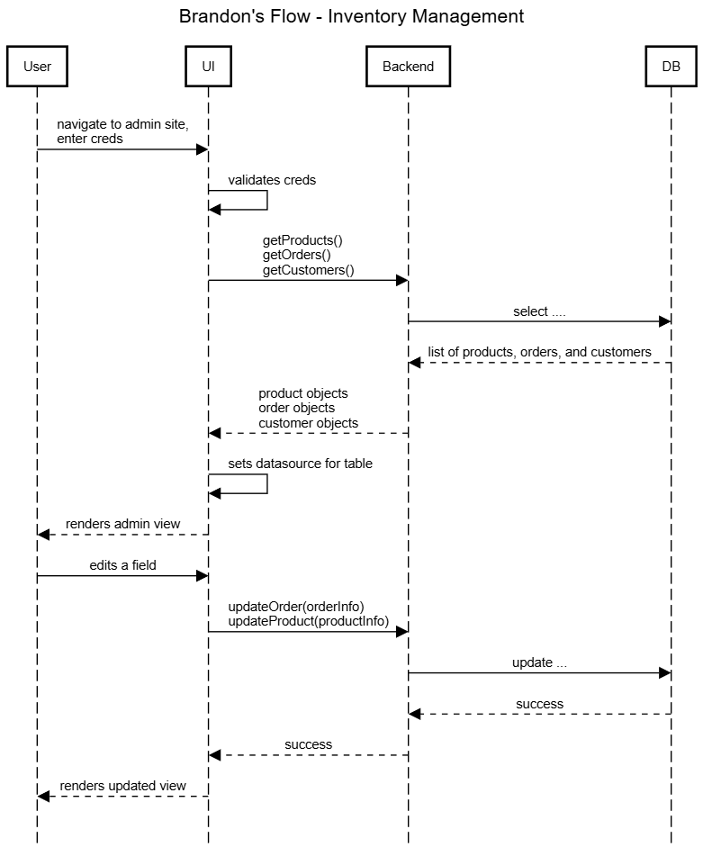

# SEIS739Project

### Brandon Torralba

### Fall 2025

## 1. Project Description

This is my final project for SEIS 739. It is a simple e-commerce website for a mock company called "Night Ops Wear" which sells military motivational merchandise. This mock company currently uses an Amazon store for their order and sales processing, but would like to save the fees that Amazon collects and would like to instead use their own site.

## 2. Tech Stack

I used a very simple tech stack here. For the frontend, I used Angular (with Angular Material for themeing). For the backend, I used SpringBoot. For the DB, I used PostgreSQL. I imagined this project as being on-prem for the MVP, but would have used Azure for cloud.

## 3. Personas

### Brandon - Business Owner

Brandon is the owner of Night Ops Wear. He is the primary stakeholder for the product. The main goal of this new website for Brandon is to quickly update inventory and let customers browse/purchase merchandise with as little friction points as possible. He is not very tech savvy and prefers simple interfaces.

### Joe - Window Shopper

Joe is on the fence for buying some merchandise. He recently saw an Instagram ad for the site and is very intrigued, but would just like to window shop for now. He is tech savvy and could perform basic functionality. He prefers clean UI and easy forms.

### Bob - #1 Customer

Bob is a huge fan of the business. He signed up for an account as soon as the site allowed it. He often visits the site and buys merchandise often. His main pain is not having any sort of way to track his order.

## 4. DB Schema Diagram

## 5. Sequence Diagrams

